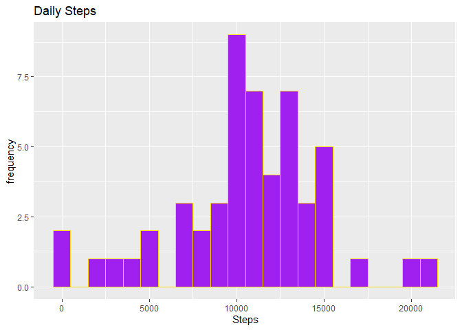
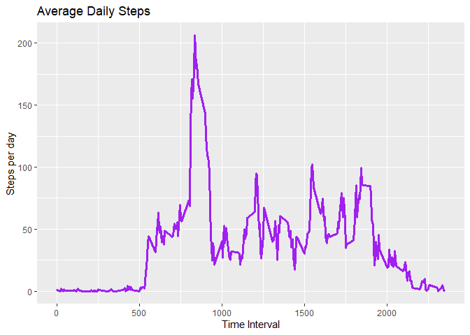
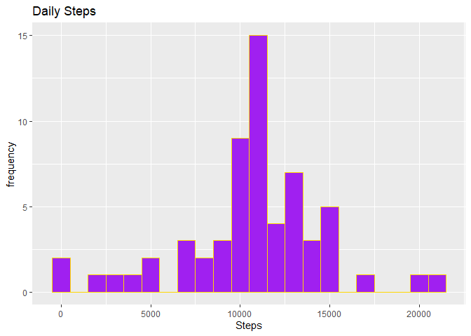

## Introduction

It is now possible to collect a large amount of data about personal movement using activity monitoring devices such as a **Fitbit**, **Nike Fuelband**, or **Jawbone Up**. These type of devices are part of the “quantified self” movement – a group of enthusiasts who take measurements about themselves regularly to improve their health, to find patterns in their behavior, or because they are tech geeks. But these data remain under-utilized both because the raw data are hard to obtain and there is a lack of statistical methods and software for processing and interpreting the data.

This assignment makes use of data from a personal activity monitoring device. This device collects data at 5 minute intervals through out the day. The data consists of two months of data from an anonymous individual collected during the months of October and November, 2012 and include the number of steps taken in 5 minute intervals each day.

Dataset: [Activity monitoring data](https://d396qusza40orc.cloudfront.net/repdata%2Fdata%2Factivity.zip)

The variables included in this dataset are:

steps: Number of steps taking in a 5-minute interval (missing values are coded as 𝙽𝙰) </br>
date: The date on which the measurement was taken in YYYY-MM-DD format </br>
interval: Identifier for the 5-minute interval in which measurement was taken </br>
The dataset is stored in a comma-separated-value (CSV) file and there are a total of 17,568 observations in this dataset.

## Loading and preprocessing the data

*Reading the data using read.csv() function*


```r
library("data.table")

library("ggplot2")
```


```r
activity <- data.table::fread(input = "repdata_data_activity/activity.csv")
```

## What is mean total number of steps taken per day?

1. *Calculate the total steps taken per day*

2. *Plot a histogram taking total steps as the parameter into consideration.*


```r
total<-activity[,c(lapply(.SD,sum,na.rm=FALSE)),.SDcols=c("steps"), by=.(date)]

ggplot(total,aes(x=steps))+geom_histogram(fill="purple",col="gold",binwidth=1000)+labs(title="Daily Steps",x="Steps",y="frequency")
```

```
## Warning: Removed 8 rows containing non-finite values (stat_bin).
```

<!-- -->

3. *Calculate and report the mean and median of the total number of steps taken per day*


```r
total[,.(Mean_steps=mean(steps,na.rm=TRUE),Median_steps=median(steps,na.rm=TRUE))]
```

```
##    Mean_steps Median_steps
## 1:   10766.19        10765
```

## What is the average daily activity pattern?

*Make a time series plot of the 5-minute interval (x axis) and the average number of steps taken averaged accross all days (y axis)*


```r
interval_daily<-activity[,c(lapply(.SD,mean,na.rm=TRUE)),.SDcols=c("steps"), by=.(interval)]

ggplot(interval_daily, aes(x=interval,y=steps))+geom_line(color="purple",size=1.25)+labs(title="Average Daily Steps",x="Time Interval",y="Steps per day")
```

<!-- -->

*To find the maximum number of steps accross a 5 minute interval on average on all days of the dataset, use the max() function:*


```r
interval_daily[steps==max(steps),.(max_steps=interval)]
```

```
##    max_steps
## 1:       835
```

## Imputing missing values

1. *Calculate the total number of missing values in the dataset*


```r
nrow(activity[is.na(steps),])
```

```
## [1] 2304
```

2. *Use either the mean/median of the day which reports NA to fill the missing values of the dataset. This program shall utilize the mean for the day to fill in NA values.* 

3. *Create a new dataset which is essentially the same dataset but with the filled in arguments for NA values.*


```r
activity[is.na(steps), "steps"] <- activity[, c(lapply(.SD, mean, na.rm = TRUE)), .SDcols = c("steps")]
```

```
## Warning in `[<-.data.table`(`*tmp*`, is.na(steps), "steps", value =
## structure(list(: 37.382600 (type 'double') at RHS position 1 truncated
## (precision lost) when assigning to type 'integer' (column 1 named 'steps')
```

```r
data.table::fwrite(x=activity,file="repdata_data_activity/NewActivity.csv",quote=FALSE)
```

4.*Plot a histogram with the newly obtained dataset and also find the mean and median of this dataset*


```r
total<- activity[, c(lapply(.SD, sum)), .SDcols = c("steps"), by = .(date)] 

total[,.(Mean_steps=mean(steps),Median_steps=median(steps))]
```

```
##    Mean_steps Median_steps
## 1:   10751.74        10656
```

```r
ggplot(total,aes(x=steps))+geom_histogram(fill="purple",col="gold",binwidth=1000)+labs(title="Daily Steps",x="Steps",y="frequency")
```

<!-- -->

**Type of Estimate** | **Mean_Steps** | **Median_Steps**
--- | --- | ---
**First Part (with na)** | 10766.19 | 10765
**Second Part (filling in na with mean)** | 10751.54 | 10656

## Are there differences in activity patterns between weekdays and weekends?

1. *Create a new factor variable in the dataset with two levels – “weekday” and “weekend” indicating whether a given date is a weekday or weekend day.*


```r
activity <- data.table::fread(input = "repdata_data_activity/activity.csv")
activity[, date := as.POSIXct(date, format = "%Y-%m-%d")]
activity[, `Day of Week`:= weekdays(x = date)]
activity[grepl(pattern = "Monday|Tuesday|Wednesday|Thursday|Friday", x = `Day of Week`), "weekday or weekend"] <- "weekday"
activity[grepl(pattern = "Saturday|Sunday", x = `Day of Week`), "weekday or weekend"] <- "weekend"
activity[, `weekday or weekend` := as.factor(`weekday or weekend`)]
head(activity, 10)
```

```
##     steps       date interval Day of Week weekday or weekend
##  1:    NA 2012-10-01        0      Monday            weekday
##  2:    NA 2012-10-01        5      Monday            weekday
##  3:    NA 2012-10-01       10      Monday            weekday
##  4:    NA 2012-10-01       15      Monday            weekday
##  5:    NA 2012-10-01       20      Monday            weekday
##  6:    NA 2012-10-01       25      Monday            weekday
##  7:    NA 2012-10-01       30      Monday            weekday
##  8:    NA 2012-10-01       35      Monday            weekday
##  9:    NA 2012-10-01       40      Monday            weekday
## 10:    NA 2012-10-01       45      Monday            weekday
```

2. *Construct a panel plot with a time series plot of the 5 minute interval (x-axis) and the average number of steps, averaged accross all days weekday or weekend (y-axis).*


```r
activity[is.na(steps), "steps"] <- activity[, c(lapply(.SD, median, na.rm = TRUE)), .SDcols = c("steps")]
interval_daily <- activity[, c(lapply(.SD, mean, na.rm = TRUE)), .SDcols = c("steps"), by = .(interval, `weekday or weekend`)] 
ggplot(interval_daily , aes(x = interval , y = steps, color=`weekday or weekend`)) + geom_line() + labs(title = "Avg. Daily Steps by Weektype", x = "Interval", y = "No. of Steps") + facet_wrap(~`weekday or weekend` , ncol = 1, nrow=2)
```

<!-- -->
